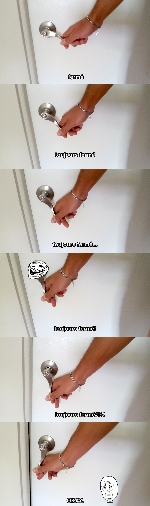
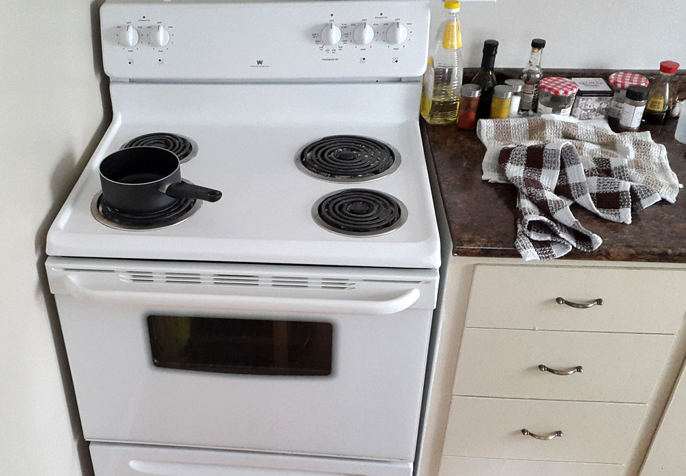
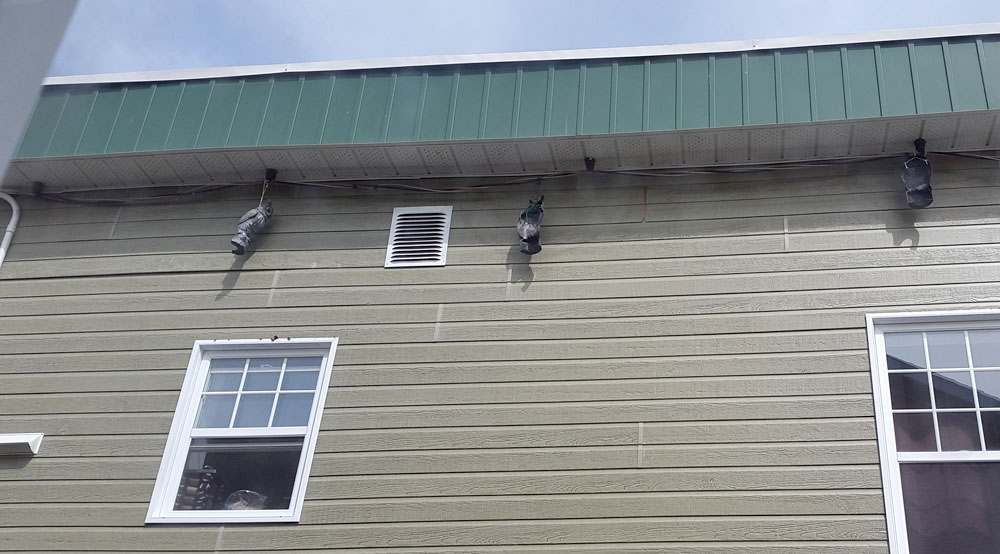

* TOC
{:toc}

# « Tu lèves la *clenche* pis tu *take* »

*C'est ce qu'on m'a dit à la station service, quand j'arrivais pas à me servir de la pompe. J'ai hoché la tête pour dire «Ah ok, faut juste lever la clenche..» ensuite j'ai cherché ce que pouvait bien être une «[clenche](https://fr.wiktionary.org/wiki/clenche)»...*  

La première différence entre la France est le Quebec est bien sur la langue. Eh oui, malgré ce qu'on croit, les français ne parlent pas tout à fait québécois, et les québécois ne parlent pas tout à fait français, même en faisant abstraction de l'accent!  
Avant d'arriver, on m'avait beaucoup parlé des *anglicismes francisés* . On nous cite souvent *Tomber en amour*, mais en réalité ce n'est pas si courant que ça et ce qui surprend, ce sont surtout des mots qui ont leurs équivalent :

- Une *laveuse*, pour la machine à laver
- Un *cabaret* pour parler d'un plateau (pour manger) mais se dit aussi du support en carton dans lequel on met les boissons chez Mc Do. La première moi qu'on m'a dit «Voulez vous un cabaret?» , j'ai dit «oui», mais surtout par curiosité.
- *Allo*, sans téléphone, juste pour dire Salut!
- le *char*, un classique
- « Vous voulez quoi comme *breuvage* ? ». On peut entendre le mot *breuvage* en France, mais c'est quand même pas tous les jours!
- On ne dira pas un "bureau de tabac" mais simplement une *tabagie*.
- Ici au Québec, les gens *écoutent* un film, alors qu'en France on a plutôt tendance à la *regarder*. Je ne sais pas vraiment d'où vient cette différence mais perso ja me vois pas dire *« Tiens, si j'écoutais un petit film de Charly Chaplin ce soir »*.

Dans un genre un peu similaire, il y a beaucoup de mots anglais/américains naturellement utilisés et intégrés. Par exemple *le brake à bras* , pour le *frein à main* (d'ailleurs le plus souvent activé par une pédale dans les voitures américaines).

Ici, peu importe à qui tu parles, le tutoiement est quasi systématique, même à la banque ou à la poste. Et c'est le plus souvent accompagné d'un « *Salut* » (ou Allo) plutôt que *Bonjour*. Peut être que c'est issu de l'anglais, ou que c'est juste pour faire plus simple, en tout c'est assez surprenant quand le flic qui t'arrête te dit :

> « *Salut, les papiers s'il te plait* »

Je ne sais pas si on peut toujours parler de tutoiement, mais nous avons constaté l'utilisation fréquente du modèle «*tu-verbe-__tu__*» , «*je-verbe-__tu__*» ou «*il-verbe-__tu__*» ou toute autre construction comportant le mot *tu* à un endroit grammaticalement étonnant/inattendu. Comme dans les (vrais) exemples suivant:

- « Tu veux tu y aller ? »
- « Je peux tu passer par cette allée ? »
- « C'est tu ouvert? »

# Les situations du quotidien

## La méteo
La météo est assez variable ici au long de l'année : l'hiver est (très) froid et (très) neigeux, le printemps est pluvieux, l'été semble être assez *humide* (bon ok, pluvieux) mais doux, et l'automne, je ne sais pas encore. En général, les gens ne se plaignent pas du temps qu'il fait, il l'accepte et de toute façon c'est comme ça. ils prennent  la route le matin même s'il est tombé 20cm de neige dans la nuit, et personne ne roule à 10km/h. Arrivé le printemps, tout le monde re-chausse les pneus d'été.
En France c'est plutôt :

- peu de différence de température ou de conditions entre l'été et l'hiver
- quasi personne n'a de pneux hiver, mais tout le monde se plaint que ça dérape
- il fait toujours « trop froid » ou « trop chaud »

Je dois admettre que c'est assez reposant de ne pas entendre les gens chialer à cause de la météo!

## Les gens

Lors ce qu'on est arrivé, dès les premiers jours nous avions remarqué que les gens étaient très serviables et très disponibles, dès lors qu'on leurs demande un conseil, une information ou un services. Un gros contrast avec la France où la dame de la poste va tirer la tronche et tenter d'en faire le minimum. Après trois mois, nous avons l'impression que les notions de politesses sont quand même à prendre avec des pincettes et dépendent de la situation.  
Par exemple les gens ne tiennent pas la porte, même si tu te trouves 50cm derrière eux. À tel point que j'ai été choqué la seule fois où une personne à maintenu la porte ouverte il y a peu.  
Dans les boutiques, il n'est pas rare que les vendeurs ne disent ni *Bonjour* ni *Au revoir* et le piéton à qui tu laisses le temps de traverser ne fera pas un signe de la main. Parfois on se sent presque bête d'être trop poli!

## Les prix

Si nous avions habité à Montreal, on n'aurait peut être pas eu besoin d'une voiture, mais à Chicoutimi, pas vraiment le choix! Quand j'ai regardé les annonces de véhicules d'occasion, je me suis demandé où était l'arnaque. Les prix sont vraiment plus bas, surtout quand on est habitué aux crevards du *bon coin* qui veulent toujours te vendre des merdes méga cher! J'aimerai bien voir comment rigoleraient les québécois si on tenter de leur vendre une Peugeot 208 d'occaz à 17000$CAD (alors que le Dodge Ram est au même prix ).  
Pour ce qui est de l'essence, c'est **vraiment** moins cher (0.80€/L à notre arrivée, 0.91€/L mi juin) mais il faut quand même relativiser. À part les véhicules asiatiques (très nombreux ici), la voiture moyenne consomme plus car ce sont des automatiques à grosses cylindrées . Par exemple, ma voiture (un genre de monospace, à une époque vendu en France sous le nom de Chrysler Voyager) consomme une bonne douzaine de litres au cent. Il faut dire que l'essence dite *ordinaire* a un indice d'octane de 87, ce qui est assez faible. À titre de comparaison, les seuls endroits où j'ai vu de l'essence avec un indice comparable sont à la frontière biélorusse et en Bosnie...  
Une autre chose assez étonnante avec l'essence : au Quebec, il n'y a jamais plus de 2 ou 3 centimes de différence entre les stations, peu importe que ce soit une grande surface one cabane au milieu de nul part! Ah, et il n'y a pas vraiment d'autoroute, les voies les plus rapides sont limitées à 110km/h, mais sont toujours gratuites!

Le Quebec a une superficie de presque 3 fois la France, et une population presque divisée par 8, autant dire que les gens peuvent être très loins les uns des autres! C'est surement ce qui explique le prix des communication, aussi bien téléphone qu'Internet... Ici on ne parle pas d' «Illimité», de «Fibre partout» ou de forfait à 20$. Quand on prend un abonnement Internet, il faut bien réfléchir :

> *« de quelle vitesse j'ai besoin? Combien de Gigas je prévois de télécharger par mois? (surtout qu'il n'y a pas de politique contre le téléchargement illégal) Est-ce que je devrais pas aussi prendre mon abonnement smartphone chez le même opérateur pour gratter 10 balles? »*

Pour faire court, internet à la maison (limité et sans téléphone fixe ni télé) + 2 abonnements smartphone avec 2Go de data chacun nous coutent 130€ par mois (contre 75€ en France avec presque tout illimité). Les ados n'ont pas tous des smartphone ici!  

Le fruits et légumes... Aah comme j'aimerai avoir les moyens de me faire 5 fruits et légumes frais par jour! C'est tellement cher ici! À part certains arrivages de Californie, les fruits et légumes sont largement 2 fois plus chers qu'en France, avec une exception pour les bananes qui ne coutent rien (pourquoi juste les bananes? et pourquoi pas les mangues? je sais pas...).

## Les moyens de paiement
En France, quand on veut payer par carte, on prend sa carte et on paye, ou alors on dit

> « *C'est possible par carte pour 4,50€ ?* »

et en général c'est pas possible alors on fait le tour de la ville pour trouver un DAB, mais disons que la difficulté s'arrête là.

Ici, il y a plusieurs chose:

- La carte de débit
- La carte de crédit
- Le chèque (en France aussi on a les chèques, mais bon... sérieusement... les chèques?)

La carte de débit fonctionne comme ce que nous appelons *carte bleue* en France, mais par partout. En effet beaucoup d'endroit ne permettent pas les achats avec une carte de débit (en particulier dans la restauration ou l'hôtellerie), et sur Internet, on ne paye pas avec une carte de débit. Qu'est ce qu'on fait alors? On demande une *carte de crédit* à sa banque, et contrairement à la France, cette carte sert **vraiment** à faire un crédit. Elle puise dans une réserve d'argent mise à disposition par la banque (mais qui ne nous appartient pas) et qu'il faudra rembourser au plus vite (au risque de payer 20% d'intérêt par mois). Sauf que pour faire un crédit, il faut pouvoir prouver qu'on est capable de rembourser, pour obtenir une carte de crédit, c'est pareil! Dans notre cas, nous avons juste du attendre 1 mois pour l'avoir, mais en général, les demandeurs sont soumis à une enquête pour vérifier si ils n'ont pas trop déconné dans la passé. Comme cette enquête ne sort pas des frontières canadiennes, il arrivent que les étranger ne puissent pas obtenir de carte de crédit, ou alors avec un plafond extrêmement faible. Une fois que t'as ta super carte de crédit, tu peux enfin payer partout! Il faut juste dire "débit" ou "crédit" à la caisse car le vendeur doit faire un réglage sur le terminal. J'ai cru comprendre qu'un certain nombre de personnes favorisaient largement la carte de *crédit* car ils s'en serve comme ce que nous appelons les *cartes à débit différés*...
Il m'arrive toujours de devoir payer avec ma Visa française, or ici les Visa sont surtout utilisées pour le crédit, du coup avec les vendeurs on essaye souvent plusieurs combinaisons:

> « Par Visa? »  
> « Euh, oui »  
> « ... »  
> « Je crois que ça marche pas là... »  
> « Pourtant c'est bien une Visa? »  
> « Oui mais je pense que c'est débit, c'est une carte française »  
> « Débit? une Visa? Bon on va essayer... »  

Et parfois, même si la boutique accepte débit et crédit (moyennant de le préciser), l'accord qu'il à avec la banque n'accepte simplement pas  les Visa.

Pour payer le loyer, ça a été aussi l'aventure. Au début, on pensait faire comme en France : un virement mensuel, avec un code IBAN chopé sur un RIB, normal quoi. Mais la banquière n'avait jamais entendu parlé de IBAN ou de RIB. De notre coté, nous n'avions jamais entendu parler d'*Intérac* , un protocole qui permet d'envoyer de l'argent avec un identifiant qui n'est autre que l'email de la personne (un peu comme avec Paypal). Pour faire ce transfert, tu dois créer une "question secrète" et ton proprio doit inscrire la réponse (que tu lui a envoyé par mail pas du tout crypté) et tout ça coute 1,50$. Ce n'est pas spécialement cher, mais c'est juste étonnant de devoir payer pour ce type de service, qui n'engage que l'échange de quelques *kilo bytes* dans des cables (en partie déjà payé par mon abonnement internet et celui de la proprio).

## D'autres trucs en vrac

Je n'ai pas vraiment trouvé de catégorie pour ça, alors je vous le met comme ça...

Quand t'es en train d'attendre au feux rouge, à un croisement, si t'as ton clignotant à droite et que t'es suivit par un autre qui veux aussi tourner à droite, t'as de forte chance de te faire klaxonner! Le code de la route indique que si c'est rouge et que tu veux tourner à droite « *Allez, c'est bon, tu peux y aller!* », sauf si t'as un feux dédié pour ceux qui tournent à droite. D'ailleurs ce feux "special" est un peu pervers : à certains croisements, il ne s'allume que pour être vert, c'est à dire que quand il devrait être rouge, en réalité, il reste éteint... Je crois que ça veut dire:

> « C'est rouge+eteint, tu as le droit de tourner, mais t'as pas le droit d'avancer » ... tricky!

Dans certaines station essences, tu dois dire combien tu veux mettre et payer avant de te servir. Pas évident si t'avais prévu de faire le plein...

Les québécois boivent beaucoup de lait. Partout il y a des petites *boites* pour le café ou pour le thé et c'est toujours proposé sur les cartes des bars.

Beaucoup de magasins vendent *" un peu de tout "* . Par exemple, les premières fois que nous sommes allez chez *Jean Coutu*, c'était pour que Pati puisse trouver du vernis à ongle, de la crème pour les mains et d'autre trucs comme ça (un peu comme on irait chez Sephora et The Body Shop). Mais on y trouve aussi des vêtements et jouets pour bébé, des chargeurs de téléphone, des montre, des boissons...  
Même scénario à la pharmacie (qui ressemble *vraiment* à une pharmacie de l'extérieur), on trouve bien sur des médocs, mais on peut y acheter quelques produits d'épicerie, des piles, des ticket à gratter (genre Bingo ou loto), et même des cigarettes. Au final, si c'est juste pour acheter du paracétamol, autant aller en grande surface (chose qu'on ne voit pas en France)! Un peu déstabilisant par rapport à nos pharmacies aseptisées où même les Dolipranes ne sont pas en libre service...

# Les objets du quotidien

- Les poignées de portes qui se baissent jusqu'en pas. Non, **VRAIMENT** jusqu'en bas:

- Toutefois, les poignées de portes d'entrées (ou de chambre d'hotel) ne sont comportent pas de levier, et sont plutôt du genre "boule" avec la serrure au centre. Petite subtilité qui nous a bien fait galérer la première fois : pour fermer à clé, il faut faire un quart de tour vers la droite, suivit d'une quart de tour vers la gauche (pour la remettre dans sa position initiale). Pour ouvrir, c'est l'inverse...

- Les appareils électroménagers sont tous plus gros qu'en France, comme par exemple cette gazinière (sans gaz) capable d'accueillir une dinde de 60kg et 4 plats à paella

(le frigo est dans le même esprit)

- Les boites-aux-lettres ne ferment pas à clé, ce sont juste des petite boites avec un rabat sur le dessus, tout juste capable de recevoir un magazine roulé. Par contre les pubs ne sont pas distribuées comme en France : une fois par semaine un sac plastique gavé de prospectus est déposé dans chaque boite (ne laissant pas franchement de place au reste). C'est pas vraiment plus écolo, mais c'est toujours mieux qu'en France...

- À l'extérieur des maison, juste sous les toits, sont souvent accrochés des faux hiboux (style sculpture bas relief), sensé faire peur aux pigeons:

Mis à part le fait que les pigeons s'en tapent complètement, ça fait un max de bruit dès qu'il y a du vent... Autre petite différence qu'on ne voit pas vraiment sur la photo (mais c'est fait exprès) : Quand les murs ont l'air d'être en bois, en réalité ils sont juste en plastique qui ressemble à du bois (qui lui même ressemble à du plastique)

- La pomme de douche accrochée au mur, pas vraiment choquant dans le cas d'une cabine de douche, mais pas du tout pratique pour rincer sa baignoire...

- Le cable internet ici n'est pas un cable téléphone (rj11) mais un coaxial. Je ne sais pas vraiment comment c'est dans les autres pays d'Europe, mais c'est bien possible que notre cable téléphone soit un héritage de l'age d'or des télécoms (avec le minitel, le tatoo et le [Bi-Bop](https://fr.wikipedia.org/wiki/Bi-Bop) et la prise péritel)

- Les pubs qui comportent souvent un portrait *corporate*, en particulier pour les offres immobilières et les sociétés de conseil. Ça donne l'impression que les gens sont rassurés de savoir qu'ils vont faire du bon business avec monsieur Patry, plutôt qu'un autre.

Je pense qu'en France en s'en tape pas mal de savoir comment s'appelle le mec qui nous loue l'appart, ou de savoir qu'il était brun mais que maintenant il est chauve...

- Rien a voir, mais le jambon ici vendu dans des blister *mous*, contrairement à la France où il est souvent placé dans une barquette semi-rigide. C'est plutôt galère à utiliser et même si c'est surement moins cher à produire, ça ne baisse pas le prix du jambon! (qui est méga cher, comme presque tout ici en fait)

Au cours de notre séjour ici nous trouverons encore pas mal de différences, mais c'est déjà un bon début!

++
